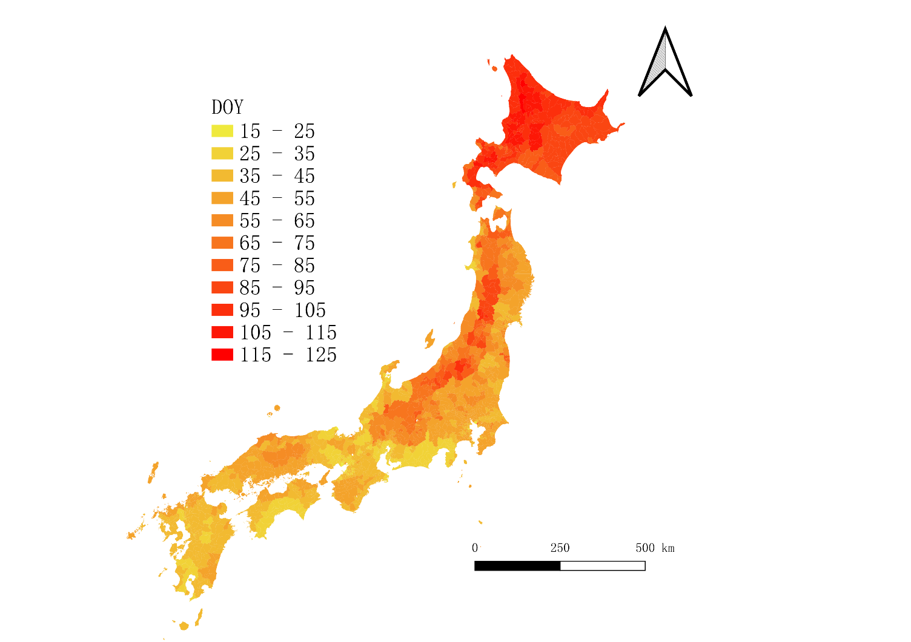
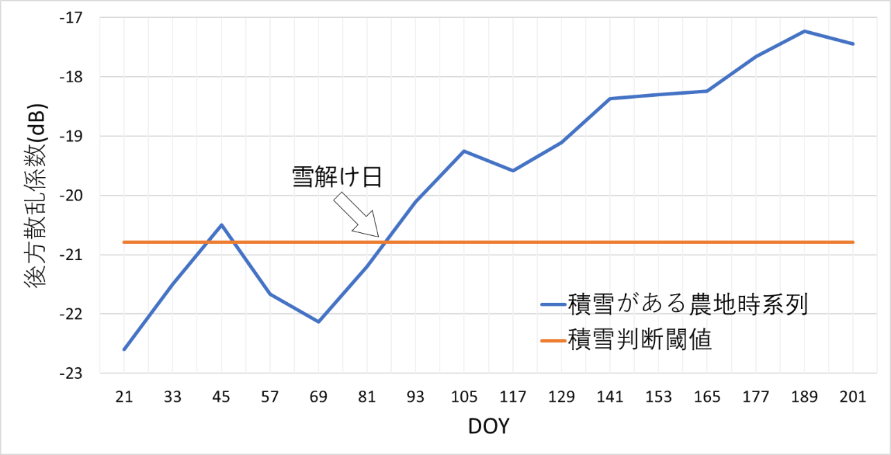
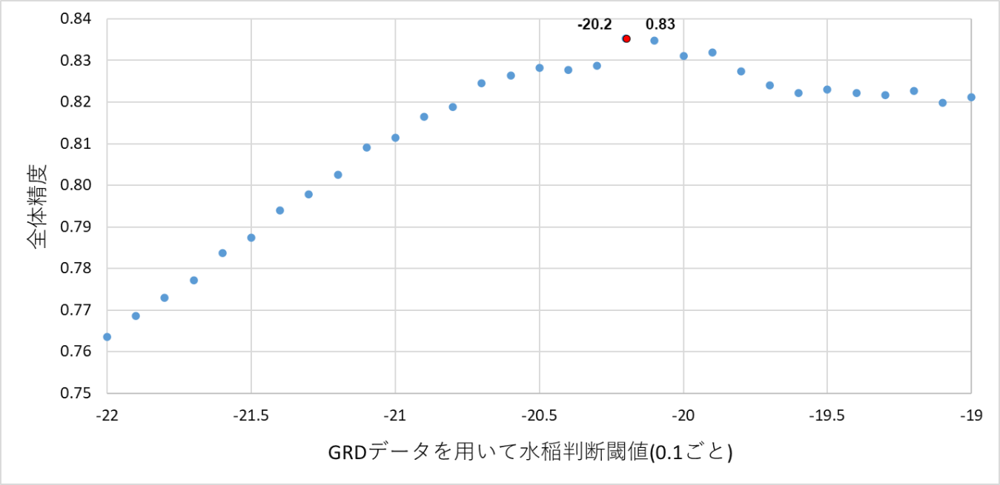
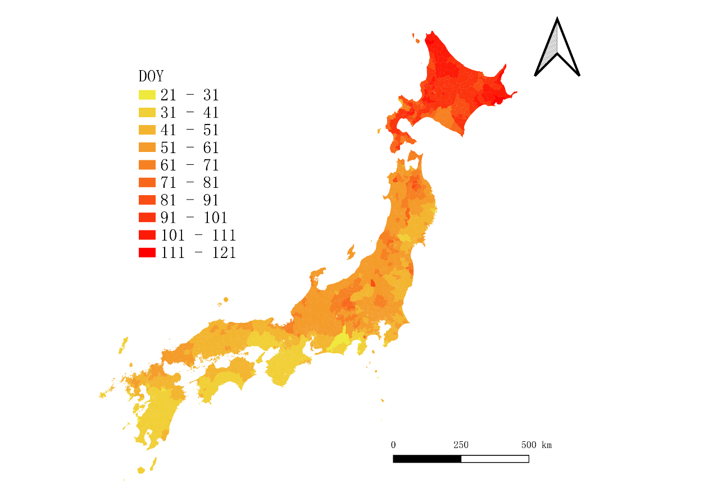

# Snow Analysis Project / 積雪解析プロジェクト

Python scripts for estimating snow presence and snowmelt timing from Sentinel-1 SAR time-series data over agricultural parcels.

Sentinel-1 SAR時系列データを用いて、農地区画ごとの積雪判定と雪解け日の推定を行うPythonスクリプト群です。

This repository is a cleaned-up code subset from my master's thesis:
"積雪の影響を考慮した全国の水稲移植時期の推定"

本リポジトリは、修士論文「積雪の影響を考慮した全国の水稲移植時期の推定」に関連する解析コードを整理したものです。

## Highlights / ハイライト

- Master's-thesis-based snow analysis workflow using Sentinel-1 SAR time-series data
- Parcel-level snow classification and snowmelt DOY estimation with Python
- Nationwide snowmelt estimation maps for Japan

- 修士論文に基づく Sentinel-1 SAR 時系列データの積雪解析ワークフロー
- Python による農地区画単位の積雪判定と雪解け DOY 推定
- 日本全国を対象とした雪解け日推定結果の可視化

## Visual Results / 成果イメージ

2021 estimated snowmelt timing map across Japan:

2021年の全国雪解け日推定結果:



Threshold-based snowmelt date estimation example:

しきい値に基づく雪解け日推定の例:



Threshold tuning result used in the study:

研究で用いたしきい値検討結果:



## Overview / 概要

In snowy regions, both snow cover and ponding reduce SAR backscatter, which makes rice-field monitoring difficult.
This project organizes the snow-related part of the workflow used in the thesis.

積雪地域では、積雪と湛水のどちらもSAR後方散乱係数を低下させるため、水田の時系列解析が難しくなります。
このプロジェクトでは、修士論文で用いた積雪関連の解析フローを整理しています。

- smooth parcel-level SAR backscatter time series
- classify parcels into `snow` / `nosnow`
- estimate the last snow-cover day with interpolation
- aggregate parcel-level DOY estimates for municipal-level analysis

- 農地区画単位のSAR後方散乱係数時系列を平滑化
- 各区画を `snow` / `nosnow` に分類
- 補間により雪解け日を推定
- 区画単位のDOY推定値を市町村単位に集約

The code was used as a preprocessing and analysis pipeline for a broader study on estimating rice transplanting dates across Japan.

本コードは、全国の水稲移植時期推定に向けた前処理および解析パイプラインの一部として使用しました。

## Research Context / 研究背景

Based on the thesis, the snow-analysis workflow uses Sentinel-1 time-series backscatter and parcel polygon data to detect the end of snow cover.

本研究では、Sentinel-1の時系列後方散乱係数と農地区画ポリゴンを用いて、積雪終了時期を推定しました。

Key ideas used in the thesis:

研究で用いた主な考え方は以下の通りです。

- A negative relationship was observed between snow depth and SAR backscatter.
- A snow-presence threshold around `-20.79 dB` was used to judge whether snow remained.
- A dry-surface threshold around `-19.41 dB` was used to distinguish snowmelt from later irrigation / ponding effects.
- Snowmelt timing was estimated from adjacent 12-day observations using linear interpolation, producing a DOY value.

- 積雪深とSAR後方散乱係数の間には負の相関が確認された
- `-20.79 dB` 付近を積雪判定のしきい値として利用した
- `-19.41 dB` 付近を乾燥状態のしきい値として用い、雪解け後の湛水と区別した
- 12日間隔の観測時系列に対して線形補間を行い、雪解け日のDOYを推定した

Reported thesis-level outputs include nationwide snowmelt estimation maps:

論文では、全国規模での雪解け日推定結果も示しました。

- 2020: estimated snowmelt dates ranged from `DOY 21-113` across `2074` municipalities.
- 2021: estimated snowmelt dates ranged from `DOY 15-118` across `2094` municipalities.

- 2020年: `2074` 市町村を対象に、推定雪解け日は `DOY 21-113`
- 2021年: `2094` 市町村を対象に、推定雪解け日は `DOY 15-118`

For reference, the 2020 nationwide map is also included below:

参考として、2020年の全国推定結果も掲載しています。



## Repository Structure / 構成

`src/smooth.py`
Smooths parcel-level backscatter series and computes angle-based geometric attributes.

農地区画ごとの後方散乱係数時系列を平滑化し、形状に関する角度指標を計算します。

`src/snowjudge.py`
Classifies each parcel as `snow` or `nosnow` from smoothed time-series values.

平滑化後の時系列を用いて、各区画を `snow` または `nosnow` に分類します。

`src/combine.py`
Estimates `DOY` / `DOY1` values by locating threshold crossings and applying linear regression interpolation.

しきい値の交差点を検出し、線形回帰補間により `DOY` / `DOY1` を推定します。

`src/DOYjudge.py`
Aggregates parcel-level `DOY` estimates to municipal averages.

区画単位の `DOY` 推定値を市町村単位の平均値へ集約します。

## Expected Input Data / 想定入力データ

The scripts assume local shapefiles already exist in the working directory, such as:

スクリプトは、作業ディレクトリ内に以下のようなShapefileが存在することを前提としています。

- `hiroshima.shp`
- `smooth.shp`
- `snowjudge.shp`
- `doy.shp`

These datasets are not included in this repository because they are large research assets and may contain redistribution restrictions.

これらのデータは、研究用データであり容量が大きいこと、また再配布に制限がある可能性があることから、本リポジトリには含めていません。

## Environment / 実行環境

Recommended Python version:

推奨Pythonバージョン:

- Python 3.10+

Install dependencies:

依存ライブラリのインストール:

```bash
pip install -r requirements.txt
```

## Example Workflow / 実行例

Run the scripts in sequence after preparing the required shapefiles:

必要なShapefileを準備した後、以下の順で実行します。

```bash
python src/smooth.py
python src/snowjudge.py
python src/combine.py
python src/DOYjudge.py
```

## Notes / 注意事項

- The current code is preserved close to the original research scripts.
- File paths and shapefile names are still analysis-oriented rather than production-oriented.
- Reproducing the full thesis results requires the original GIS datasets and preprocessing outputs.

- 現在のコードは、研究時のスクリプト構成をできるだけ保った形で公開しています。
- ファイル名や入出力名は、研究用途に合わせたままで、一般公開向けに完全には整理していません。
- 論文全体の結果を完全に再現するには、元のGISデータおよび前処理済みデータが必要です。

## Portfolio Description / ポートフォリオ向け説明

This project demonstrates:

このプロジェクトを通して、以下の内容を示すことができます。

- SAR remote sensing analysis with Python
- geospatial processing with shapefiles and parcel polygons
- time-series thresholding and interpolation
- research workflow design from raw observations to interpretable DOY indicators

- PythonによるSARリモートセンシング解析
- Shapefileと農地区画ポリゴンを用いた地理空間処理
- 時系列しきい値判定と補間処理
- 生データから解釈可能なDOY指標へ落とし込む研究ワークフロー設計

Short description for GitHub / portfolio use:

GitHubやポートフォリオ用の短い説明:

"A Python-based geospatial analysis workflow developed from my master's research. It uses Sentinel-1 SAR time-series data to detect snow cover and estimate snowmelt timing over agricultural parcels, supporting downstream estimation of rice transplanting dates in snowy regions of Japan."

「修士研究をもとに構築したPythonベースの地理空間解析プロジェクトです。Sentinel-1 SARの時系列データを用いて、農地区画ごとの積雪判定と雪解け日推定を行い、積雪地域における水稲移植時期推定の前段階を支援します。」
